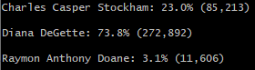

# Election Audit (election-analysis)
Python challenge project to provide analysis of a .csv file containing a list of ballots.

## Overview of Election Audit
The purpose of this audit is to quickly tally the ballots in the included .csv file in order to provide a breakdown of the voting results by both canidate and county. During the breakdown we also present the winning canidate, along with the county with the highest voter turnout.

## Election Audit Results

* **How many votes were cast in this congressional election?**  
  
* **Provide a breakdown of the number of votes and the percentage of total votes for each county in the precinct.**  
  
* **Which county had the largest number of votes?**  
  
* **Provide a breakdown of the number of votes and the percentage of the total votes each canidate recieved.**  
  
* **Which canidate won the election, what was their vote count, and what was their percentage of the total votes?**  
  

## Election Audit Summary
To summarize, this script is already capable of quickly tallying votes and sorting those votes by county. As the script stands currently it could be used in any election where the data is available to be sorted to include county information in addition to canidate voted for. The script could also easily be modified to work without counties being provided. In addition, in this given example the script could be expanded upon to show information such as which canidate has the highest vote count in each county, as well as many other statistics.
